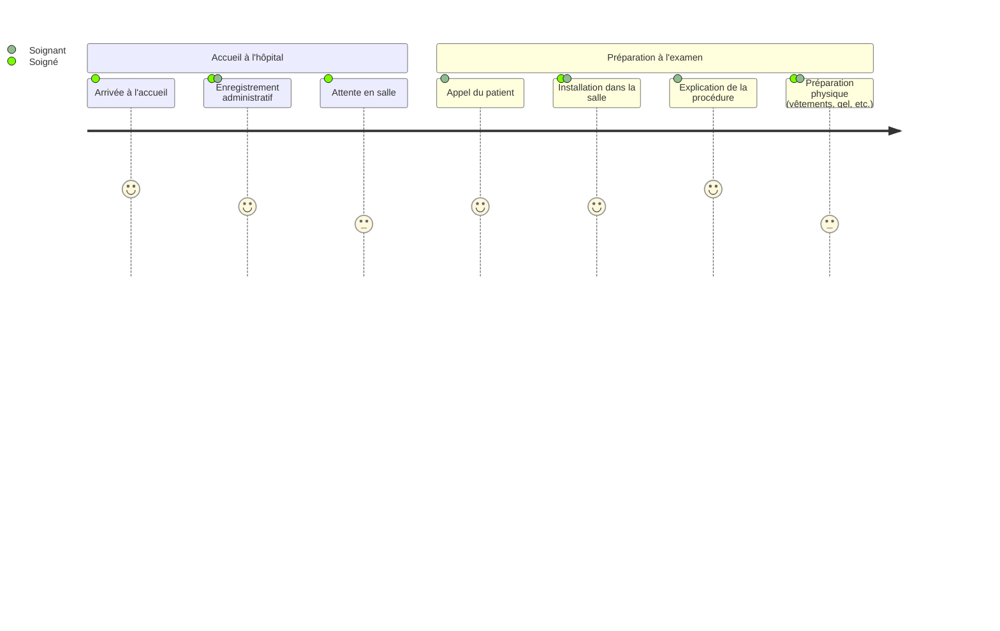
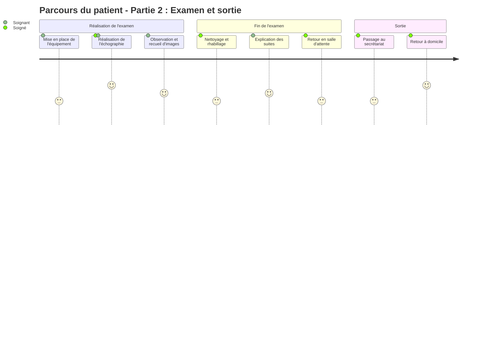

# Test de galerie d'images et videos

## une galerie d'images

  
<!-- {p:.galerie} -->

## une video youtube
[](https://youtube.com/watch?v=_etHH7s8oNQ "Video Title")

## une video vimeo
[](https://player.vimeo.com/video/1102723937 "iléon")


## une video et des images dans une galerie

  [](https://youtube.com/watch?v=_etHH7s8oNQ "innovation en échographie")
<!-- {p:.galerie} -->


## Une liste de pathologies digestives courantes par organe

La liste suivante présente des **exemples de pathologies** associées à certains **organes digestifs** pris en charge en gastro-entérologie.

- Foie
  - Hépatite virale
  - Stéatose hépatique
  - Cirrhose
- Pancréas
  - Pancréatite aiguë
  - Pancréatite chronique
  - Tumeur pancréatique
  
## Un diagramme Mermaid, le parcours de patient

Ce scénario illustre le parcours type d’un patient venant réaliser un examen échographique dans un établissement de santé. Il s'agit d'un exemple fictif destiné à visualiser les différentes étapes, de l’arrivée du patient à l’hôpital jusqu’à son retour à domicile.
Chaque phase met en lumière l’implication du **soigné** (le patient) et du **soignant** (infirmier, échographiste, personnel administratif…), selon leur rôle respectif dans le déroulement de l’examen.

### Parcours du patient - Partie 1 : Accueil et préparation

### Partie 2 : De la réalisation de l’examen jusqu’au retour à domicile


## Une table, usages de l'échographie

Voici une table en Markdown listant différents **usages courants de l’échographie** ainsi qu’une estimation approximative de leur **part dans l’usage global (en pourcentage)**. Ces chiffres sont représentatifs d’une répartition typique en milieu hospitalier ou en cabinet, à titre indicatif.

| Usage de l’échographie                  | Description                                    | Part  de l’usage total (%) |
|-----------------------------------|------------------------------------------------------|----------------------------|
| Obstétrique / Gynécologie         | Suivi de grossesse, exploration pelvienne            | 40%                        |
| Abdominale                        | Foie, reins, vésicule biliaire, rate, pancréas       | 20%                        |
| Vasculaire (Doppler)              | Veines, artères, circulation sanguine                | 15%                        |
| Musculo-squelettique              | Tendons, muscles, ligaments                          | 10%                        |
| Cardiaque (échocardiographie)     | Fonction cardiaque, valves, péricarde                | 8%                         |
| Thyroïdienne / cervicale          | Thyroïde, ganglions, glandes salivaires              | 5%                         |
| Autres                            | Divers examens spécifiques ou guidés                 | 2%                         |


## Diagramme de séquence PlantUML 
Voici un exemple de diagramme de séquence PlantUML décrivant une interaction typique entre une sonde d’échographie et un logiciel d’imagerie médicale :
```plantuml
title Interaction entre une sonde d'échographie et le logiciel d'imagerie

actor Utilisateur
participant "Sonde d'échographie" as Sonde
participant "Logiciel d'imagerie" as Logiciel

Utilisateur -> Sonde : Démarrer la capture
Sonde -> Logiciel : Envoyer signal d'initialisation
Logiciel -> Sonde : Accuser réception et préparer interface

loop Acquisition continue
    Sonde -> Logiciel : Envoyer données brutes (ultrasons)
    Logiciel -> Logiciel : Traitement des données\n(filtrage, interpolation)
    Logiciel -> Logiciel : Reconstruction de l'image
    Logiciel -> Utilisateur : Afficher l’image en temps réel
end

Utilisateur -> Sonde : Arrêter la capture
Sonde -> Logiciel : Envoyer signal d’arrêt
Logiciel -> Utilisateur : Confirmer arrêt et sauvegarder l'image
```

- [Requirements *Server and database prerequisites.*](/install/requirements)
- [Installation Guide *Detailed installation instructions for all platforms.*](/install)
{.links-list}

## attributs d'image


La figure 1 illustre les 5 couches de la paroi :
1. l'interface avec la lumière (hyper échogène)
1. la muqueuse (hypo échogène)
1. la sous muqueuse (hyper échogène)
1. la musculeuse (hypo échogène)
1. l'interface séreuse-extérieur du tube (hyper échogène)

## markdown + attributes


<Figure id="fig1">
  
  <figcaption>Figure 1</figcaption>
 </Figure>
 
 


La figure 1 illustre les 5 couches de la paroi 
1. l'interface avec la lumière (hyper échogène)  
2. la muqueuse (hypo échogène)  
3. la sous muqueuse (hyper échogène)  
4. la musculeuse (hypo échogène)  
5. l'interface séreuse-extérieur du tube (hyper échogène)  


