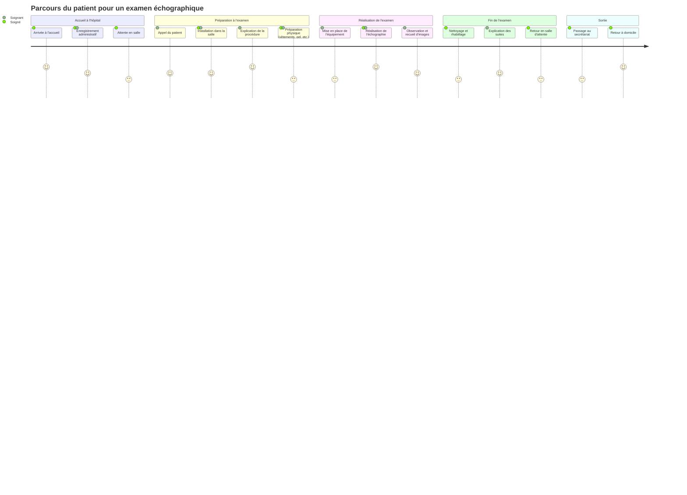

# Test de gallerie d'images et videos

## une gallerie d'images

  
<!-- {p:.gallerie} -->

## une video youtube

## une video et des images dans une gallerie

  
<!-- {p:.gallerie} -->

## un diagramme Mermaid

Salut, madame la sonde,
cette partie a été éditée sur github

